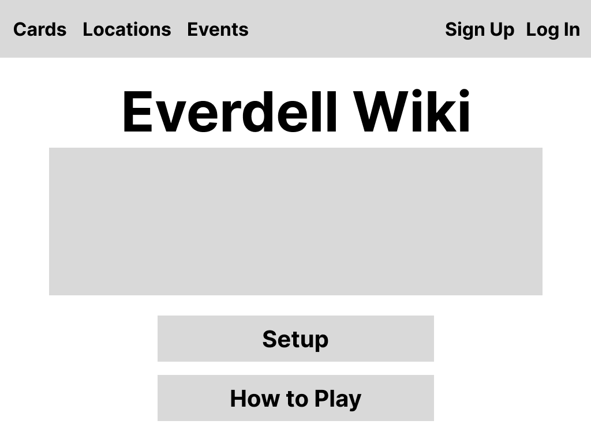
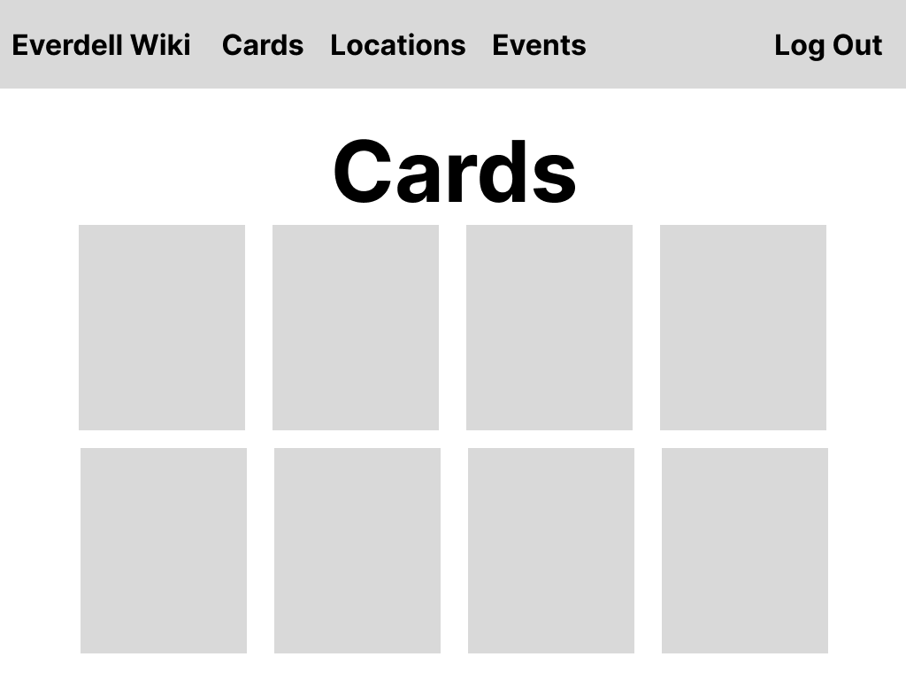

# Everdell-Wiki

  Inspired by my constant obsession with video game wikis and what I feel is a severe lack of information online about some of my favorite board games, I decided to build my own wiki for one of my favorite games, Everdell. The wiki is intended to be collaborative, so it will allow users to help add and edit content. The hope is that I could establish a framework with this project that I could adapt and reuse in the future to build more wikis for other board and card games. 

## Technologies / Languages

- HTML
- CSS
- JavaScript
- Express
- Mongoose 
- Node
- Bootstrap
- Liquid

## How it's Built

This app will use the MVC system for organizing the code, breaking the app down into three key parts: models, views, and controllers.

I'm using the express framework to build a server, in which I'm using mongoose to process requests and run CRUD operations using a mongoDb database. The app will feature user authentication for wiki moderation and content additions/edits. It will also have the ability for users to add comments on the various game resources (so users can discuss best strategies, tips, tricks, etc.).

## User Stories

```
As a user, I want the ability to: 
  - sign up
  - log in
  - log out
  - add resources
  - edit resources
  - view all resources in a list
  - view more details of individual resources
  - delete resources
  - view all of my contributions
  - comment on resources
```

## Route Tables

#### Cards

| **URL**         | **HTTP Verb** | **Action** |
|-----------------|---------------|------------|
| /cards          | GET           | index
| /cards/:id      | GET           | show
| /cards/new      | GET           | new
| /cards          | POST          | create
| /cards/:id/edit | GET           | index
| /cards/:id      | PATCH/PUT     | update
| /cards/id       | DELETE        | destroy

## Locations

| **URL**         | **HTTP Verb** | **Action** |
|-----------------|---------------|------------|
| /locations      | GET           | index
| /locations/:id  | GET           | show

## Events

| **URL**         | **HTTP Verb** | **Action** |
|-----------------|---------------|------------|
| /events         | GET           | index
| /events/:id     | GET           | show

#### Users

| **URL**        | **HTTP Verb** | **Action** |
|----------------|---------------|------------|
| /users/signup  | GET           | new        |
| /users/login   | GET           | login      |
| /users/signup  | POST          | create     |
| /users/login   | POST          | create     |
| /users/logout  | DELETE        | destroy    |

#### Comments

| **URL**                             | **HTTP Verb** | **Action** |
|-------------------------------------|---------------|------------|
| /comments/:cardId                   | POST          | create     |
| /comments/delete/:cardId/:commentId | GET           | destroy    |

## Wireframes






## Models

```
Card: {
  name: String,
  quantity: Number,
  type: String,
  cost: String,
  description: String,
  rarity: String,
  points: Number,
  critter: Boolean,
  construction: Boolean
}

Location: {
  name: String,
  occupancy: Number,
  effect: String
}

Event: {
  name: String,
  points: Number,
  description: String,
  special: Boolean,
  cardsRequired: [String]
}

User: {
  username: String,
  password: String
}
```

## Entity Relationship Diagram


